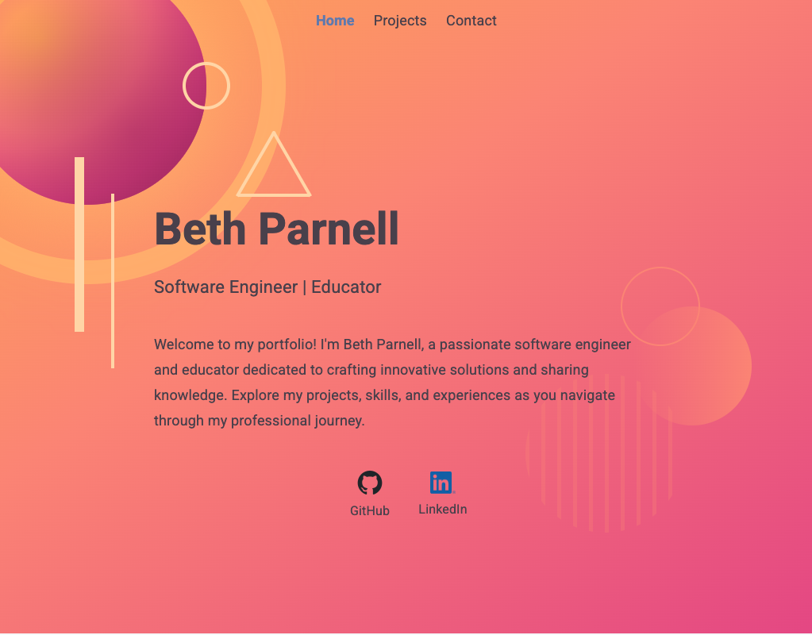
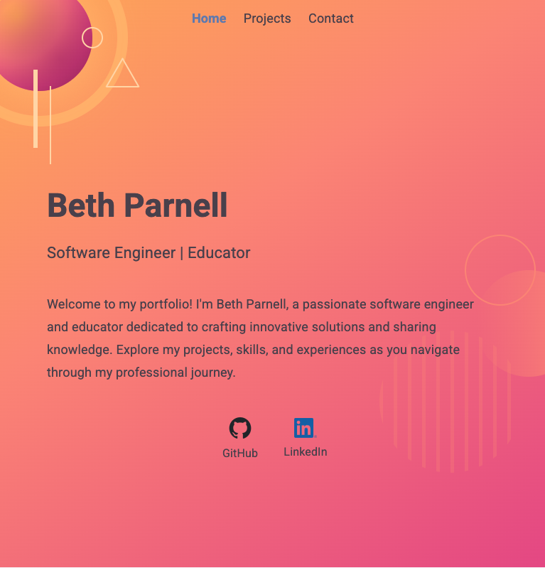

# 🌟 Beth Parnell's Portfolio

[](https://nextjs.org/)
[](https://reactjs.org/)
[](https://www.typescriptlang.org/)
[](https://github.com/css-modules/css-modules)
[](https://eslint.org/)

> A modern, responsive portfolio website showcasing software engineering projects and expertise. Built with Next.js 15 and featuring clean abstract art-inspired design and an interactive project showcase.

## 🚀 Live Demo

🔗 **[View Portfolio](https://your-portfolio-url.netlify.app)** *(Update with your actual URL)*

## 📱 Screenshots

### Desktop View


*Clean, professional layout with full navigation and project showcase*

### Tablet View


*Optimized layout for medium screens with adapted navigation*

### Mobile View


*Mobile-first design with touch-friendly navigation and responsive cards*

## ✨ Features

- 🎨 **Modern Design** - Clean, professional interface with abstract art-inspired visual elements
- 📱 **Fully Responsive** - Optimized for all device sizes and screen resolutions
- ⚡ **Next.js 15** - Latest React framework with App Router architecture
- 🧩 **Modular Components** - Reusable UI components with TypeScript interfaces
- 🔍 **SEO Optimized** - Meta tags and structured data for search engines
- 🎯 **Performance Focused** - Optimized images and efficient rendering
- 📊 **Project Showcase** - Interactive cards displaying technical projects with live links
- 📄 **Resume Integration** - Direct PDF resume access in new tab
- 🌈 **CSS Variables** - Centralized theming system for consistent design

## 🛠️ Tech Stack

### Frontend

- **Framework**: Next.js 15.5.5
- **Library**: React 19.1.0
- **Language**: TypeScript 5.0
- **Styling**: CSS Modules with clean design patterns
- **Icons**: Custom SVG icons and Image optimization

### Development Tools

- **Linting**: ESLint 9.0 with custom configuration
- **Package Manager**: npm
- **Version Control**: Git with conventional commits
- **Deployment**: Netlify

### Key Features Implemented

- **Abstract Visual Elements**: Clean geometric shapes and modern color palette
- **Responsive Card Components**: Project showcase with clean layouts
- **Responsive Navigation**: Clean horizontal navigation across all devices
- **Scrollable Project Gallery**: Smooth scrolling with organized content display

## 📁 Project Structure

```plaintext
├── public/
│   ├── icons/                      # SVG and PNG icons (GitHub, LinkedIn, resume)
│   ├── favicon files               # Favicon set (16x16, 32x32, apple-touch-icon, etc.)
│   ├── resume.pdf                  # Resume PDF file
│   └── site.webmanifest           # Web app manifest
├── screenshots/
│   ├── desktop-view.png           # Desktop screenshot for README
│   ├── tablet-view.png            # Tablet screenshot for README
│   └── mobile-view.png            # Mobile screenshot for README
├── src/
│   ├── app/
│   │   ├── layout.tsx              # Root layout component
│   │   └── (site)/
│   │       ├── layout.tsx          # Site-wide layout component
│   │       ├── layout.module.css   # Layout styling with CSS variables
│   │       ├── page.tsx            # Home page with abstract visual elements
│   │       ├── page.module.css     # Home page styling
│   │       ├── error.tsx           # Error boundary component
│   │       ├── loading.tsx         # Loading component
│   │       ├── not-found.tsx       # 404 page component
│   │       ├── projects/
│   │       │   ├── page.tsx        # Projects showcase page
│   │       │   └── page.module.css # Projects page styling
│   │       └── test/
│   │           └── page.tsx        # Test page component
│   ├── styles/
│   │   ├── globals.css             # Global styles and CSS variables
│   │   └── typography.css          # Typography system and font definitions
│   └── ui/
│       ├── Card/
│       │   ├── index.tsx          # Reusable card component
│       │   └── Card.module.css    # Card styling with clean layouts
│       └── Navbar/
│           ├── index.tsx          # Navigation component
│           └── Navbar.module.css  # Navbar responsive styling
├── eslint.config.mjs               # ESLint configuration
├── next.config.ts                  # Next.js configuration
├── package.json                    # Dependencies and scripts
└── tsconfig.json                   # TypeScript configuration
```

## 🎨 Design System

### Color Palette

- **Primary Orange**: `#F9B256` - Primary brand color
- **Secondary Orange**: `#F7917D` - Secondary accent
- **Accent Pink**: `#E35390` - Gradient accent
- **Deep Purple**: `#A42C6B` - Deep accent
- **Highlight Orange**: `#fdc070` - Highlight color
- **Light Accent**: `#ffdbac` - UI element color

### Typography

- **Font Family**: Roboto with system font fallbacks
- **Responsive Scaling**: Fluid typography using `clamp()`
- **8px Grid System**: Consistent spacing and rhythm

## 🚀 Getting Started

### Prerequisites

- Node.js 18.0 or later
- npm or yarn package manager

### Installation

1. **Clone the repository**

   ```bash
   git clone https://github.com/ejparnell/portfolio.git
   cd portfolio
   ```

2. **Install dependencies**

   ```bash
   npm install
   ```

3. **Run the development server**

   ```bash
   npm run dev
   ```

4. **Open your browser**
   Navigate to [http://localhost:3000](http://localhost:3000)

### Available Scripts

```bash
# Development server
npm run dev

# Production build
npm run build

# Start production server
npm run start

# Run ESLint
npm run lint

# Type checking
npm run type-check
```

## 📱 Responsive Design

The portfolio is fully responsive with breakpoints at:

- **Mobile**: < 768px
- **Tablet**: 768px - 1024px
- **Desktop**: 1024px - 1440px
- **Large Desktop**: > 1440px

### Special Features

- Abstract visual elements scale appropriately across screen sizes
- Navigation centers on desktop, right-aligns on mobile
- Project cards adapt to container width
- Typography scales fluidly across all devices

## � Design Features

### Abstract Visual Elements

- **Geometric Shapes**: Clean, modern geometric forms
- **Color Gradients**: Subtle gradient transitions for visual depth
- **Responsive Design**: Elements adapt seamlessly to different screen sizes

### Clean Component Design

- **Minimalist Cards**: Clean project showcase with organized information
- **Consistent Spacing**: 8px grid system for uniform layout
- **Typography Hierarchy**: Clear content organization and readability

## 📊 Performance Optimizations

- ✅ **Next.js Image Optimization**: Automatic image compression and WebP conversion
- ✅ **CSS Modules**: Scoped styling with minimal bundle impact
- ✅ **Component Memoization**: Optimized re-renders with React.memo
- ✅ **CSS Variables**: Centralized theming reduces redundancy
- ✅ **Modern CSS**: Clean, efficient styling patterns
- ✅ **Netlify Deployment**: Fast global CDN and optimized builds

## 🤝 Contributing

While this is a personal portfolio, feedback and suggestions are welcome!

1. Fork the repository
2. Create a feature branch (`git checkout -b feature/improvement`)
3. Commit your changes (`git commit -m 'Add some improvement'`)
4. Push to the branch (`git push origin feature/improvement`)
5. Open a Pull Request

## 📄 License

This project is licensed under the MIT License - see the [LICENSE](LICENSE) file for details.

## 👩‍💻 About the Developer

**Beth Parnell** - Software Engineer | Educator

- 🔗 **Portfolio**: [Live Site](https://your-portfolio-url.netlify.app)
- 💼 **LinkedIn**: [elizabethjparnell](https://www.linkedin.com/in/elizabethjparnell/)
- 🐙 **GitHub**: [ejparnell](https://github.com/ejparnell)

## 🙏 Acknowledgments

- **Next.js Team** - For the amazing React framework
- **Abstract Art Movement** - Inspiration for clean geometric design
- **Netlify** - For seamless deployment platform and global CDN
- **React Team** - For the powerful UI library

---

**⭐ Star this repository if you found it helpful!**

Made with ❤️ and lots of ☕ by [Beth Parnell](https://github.com/ejparnell)
